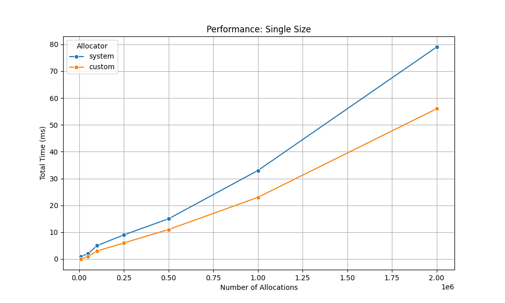
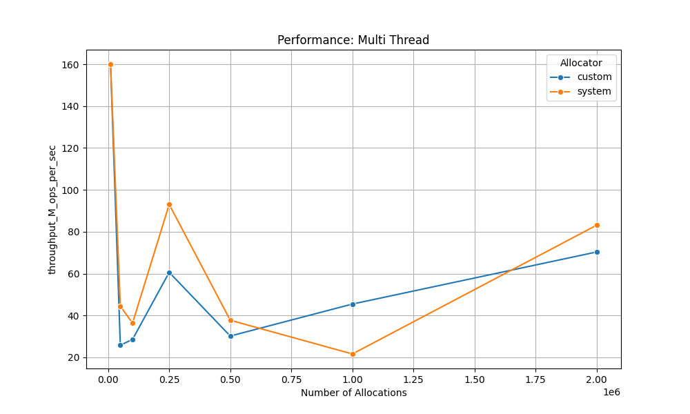

# C++ Custom Memory Allocator

[]()

A custom, high-performance memory pool allocator written in C/C++. It is designed for multi-threaded applications to significantly reduce the overhead and contention associated with standard library memory functions like `malloc` and `free`.

***

## 📋 Table of Contents

* [Key Features](#-key-features)
* [Project Structure](#-project-structure)
* [How to Build and Run](#️-how-to-build-and-run)
* [Performance Results](#-performance-results)
* [How It Works (Architecture)](#️-how-it-works-architecture)
* [Contact](#-contact)

***

## ✨ Key Features

* **High-Performance:** Significantly faster than the standard system `malloc` in multi-threaded scenarios by reducing lock contention.
* **Thread-Safe by Design:** Utilizes `thread_local` caches to give each thread its own private pool of memory blocks, minimizing the need for expensive mutex locks.
* **Efficient Memory Usage:** Employs a **segregated-fit** strategy, maintaining separate memory pools for different block sizes to reduce fragmentation.
* **Batch Memory Management:** Thread caches are refilled from the central pool in batches, amortizing the cost of locking. A high-water mark mechanism returns excess memory back to the central pool.
* **Cross-Platform:** An OS abstraction layer uses `mmap` on POSIX systems (Linux, macOS) and `VirtualAlloc` on Windows to request memory directly from the operating system.
* **Comprehensive Benchmarking:** Includes a detailed benchmark suite to compare the performance against the system's default allocator in various scenarios (single-thread, multi-thread, random sizes).


***
## 📁 Project Structure

The project is organized into separate directories for headers, source files, and tests to maintain a clean and scalable codebase.

```
.
├── include/              # Header files (.hpp) defining the interfaces
│   ├── MemoryPool.hpp
│   ├── OS.hpp
│   └── PoolAllocator.hpp
├── src/                  # Source files (.cpp) containing the implementation
│   ├── OS.cpp
│   └── PoolAllocator.cpp
├── tests/                # Source files for the benchmark executable
│   └── main.cpp
├── Makefile              # The build script for compiling the project
├── plot_results.py       # Python script to visualize benchmark data
└── README.md             # Project documentation

```


***
## ⚙️ How to Build and Run

This project uses a `Makefile` to simplify the build and testing process. The following steps will guide you through compiling the code, running the benchmarks, and generating performance plots.

### 1. Requirements

* **C++ Compiler:** A compiler that supports C++17 (e.g., GCC, Clang, MSVC).
* **Make:** The `make` build automation tool.
* **Python 3.x:** For running the plotting script.
* **Python Libraries:** `pandas`, `seaborn`, and `matplotlib`. You can install them with pip:
    ```bash
    pip install pandas seaborn matplotlib
    ```

### 2. Compile the Project

Navigate to the project's root directory and run the `make` command. This will compile all necessary source files and create the executable `allocator_test` in the root directory.

   ```bash
   make
   ```


### 3. Run the Benchmarks

The compiled executable has two modes:
* `benchmark`: Runs a quick performance comparison against the system malloc and prints a summary directly to the console.

```bash
./allocator_test benchmark
```

* `plot`: Generates the raw data files (results.csv, results2.csv, results3.csv) required for creating the performance graphs.

```bash
./allocator_test plot
```

### 4. Generate Performance Plots (Recommended)
To simplify the entire process, you can use the custom `plot` command in the `Makefile`. This single command will:

1. Compile the project if any files have changed.

2. Run `./allocator_test plot` to generate the CSV data.

3. Execute the `plot_results.py` script to create the `.png` image files.


```bash
make plot
```
This is the recommended way to generate the performance graphs from scratch.

### 5. Clean Up
To remove the compiled executable and all temporary object files, run the clean command:

```bash
make clean
```
***

## 🏗️ How It Works (Architecture)

The allocator is built on a three-layer architecture, providing a clear separation of concerns from the OS level up to the user-facing API.

### 1. OS Abstraction Layer (`OS.cpp`)

This is the lowest level, responsible for interacting with the operating system to request large chunks of virtual memory.

* On **POSIX** systems (Linux, macOS), it uses `mmap`.
* On **Windows**, it uses `VirtualAlloc` and `VirtualFree`.

This abstracts away platform-specific details, allowing the higher-level allocators to work with a simple `alloc_chunk()` and `free_chunk()` interface.

### 2. The Core `MemoryPool<T>` (`MemoryPool.hpp`)

This class is the workhorse for a **single size class**.

* It is a C++ template (`MemoryPool<size_t BlockSize>`) that manages memory blocks of one specific size.
* When initialized or exhausted, it requests a large **chunk** (e.g., 64KB) from the OS Abstraction Layer.
* This chunk is then partitioned into smaller `BlockSize` blocks.
* These blocks are managed using an **intrusive free-list**, where the `next` pointer is stored within the free block itself, eliminating the need for separate metadata and maximizing memory usage.

### 3. The `PoolAllocator` (`PoolAllocator.cpp`)

This is the top-level, user-facing class that ties everything together. It is responsible for handling requests for various sizes and managing thread safety.

1.  **Segregated Pools:** It maintains an array of `MemoryPool<T>` instances, each for a different size class (e.g., 8, 16, 24, ..., 512 bytes). A lookup table (`m_size_to_pool_index`) allows for $O(1)$ mapping of a requested size to the appropriate pool.

2.  **Thread-Local Caching:**
    To avoid locking a global mutex on every `allocate`/`deallocate` call, each thread has its own private cache of free blocks for each size class.
    * **Allocation:** When `allocate(size)` is called, it first checks the current thread's local cache. If the cache has a free block, it's returned immediately—**with no locking required**.
    * **Cache Miss:** If the thread's cache is empty, it calls a `refill_cache()` function. This function locks the corresponding global `MemoryPool`'s mutex, grabs a **batch** of blocks (e.g., 64), adds them to the thread-local cache, and then unlocks the mutex. This amortizes the cost of locking over many allocations.
    * **Deallocation:** When `deallocate(ptr)` is called, the block is returned to the thread's local cache—again, **with no locking**.

3.  **Returning Memory:** If a thread's local cache grows too large (exceeds the `HIGH_WATER_MARK`), a batch of its free blocks are moved back to the central `MemoryPool` to be made available to other threads.


***

## 🚀 Performance Results

The custom allocator was benchmarked against the standard system `malloc` in three distinct scenarios to evaluate its performance characteristics. The tests were conducted for single-threaded fixed-size allocations, single-threaded random-size allocations, and a multi-threaded contention workload.

### Single-Threaded Performance




* **Fixed-Size Allocations:** The custom allocator demonstrates a clear and consistent performance advantage. As shown in the `Performance: Single Size` graph, its total execution time is consistently lower than the system allocator. At two million allocations, the custom allocator is approximately **30% faster** (56 ms vs. 80 ms). This highlights its efficiency for predictable memory patterns.
* **Random-Size Allocations:** For random-size allocations, the custom allocator's performance is highly competitive with the system `malloc`. The `Performance: Random Size` graph shows that both allocators perform nearly identically, with the custom allocator showing a marginal improvement at higher allocation counts. This indicates that the overhead of its size-mapping logic is minimal.

***
### Multi-Threaded Performance

This benchmark measures throughput in millions of operations (allocations + deallocations) per second, where a higher value is better. This test is designed to create high contention among threads to simulate a demanding, real-world server environment.



* **Throughput Analysis:** The `Performance: Multi Thread` graph reveals different characteristics for each allocator under load.
    * The **system allocator** (orange line) exhibits higher peak throughput in this specific test but shows significant volatility. Its performance fluctuates sharply depending on the number of allocations, suggesting it is sensitive to certain contention levels.
    * The **custom allocator** (blue line) demonstrates more **stable and predictable throughput**. While its peak is lower than the system's in this test, it avoids the extreme drops in performance, providing more consistent behavior across the workload.

### Key Takeaways

* The custom allocator is significantly faster than `malloc` in **single-threaded, fixed-size** workloads.
* It is on par with `malloc` in **single-threaded, random-size** workloads.
* In the **multi-threaded contention test**, while the system allocator achieved higher peaks, the custom allocator provided more **consistent and predictable performance**, which is a critical feature for applications that require stable latency under stress.


***

## 📧 Contact

- **Name:** Ryan Park
- **Email:** [parkryan0128@gmail.com](mailto:parkryan0128@gmail.com)
- **LinkedIn:** [https://www.linkedin.com/in/parkryan0128](https://www.linkedin.com/in/parkryan0128)
- **GitHub:** [https://github.com/Parkryan0128](https://github.com/Parkryan0128)


&emsp;
&emsp;
&emsp;
&emsp;
&emsp;
&emsp;
&emsp;
&emsp;
